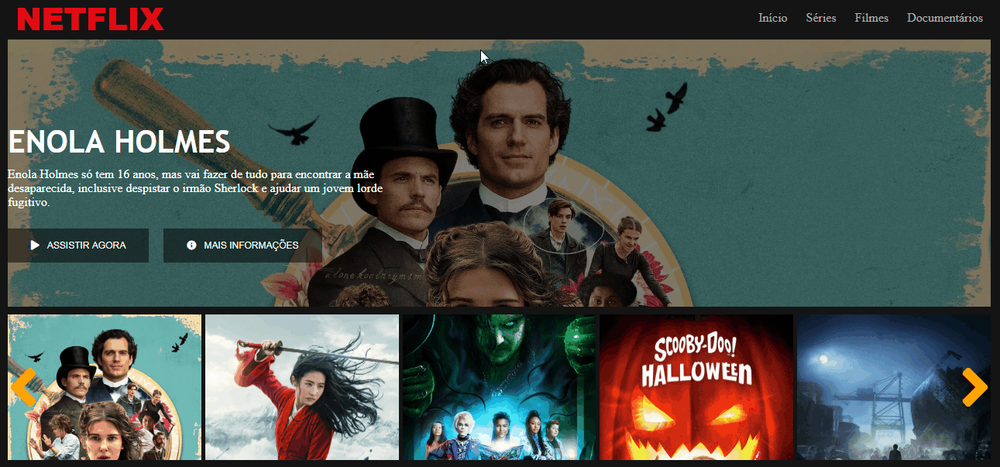

# netflix-interface

Recriação da página inicial do Netflix usando como base a aula do Bootcamp de React Web Developer da Digital Innovation.

Ao invés de utilizar informações estáticas nos campos do filme principal, fez-se uso da API do The Movie Database ([TMDb](https://developers.themoviedb.org/3/getting-started/introduction)) para obter o título do filme, sua descrição e uma imagem do filme.

Para o carrossel, em vez de usar a implementação ensinada usando o plug-in jQuery mostrado no curso, tentei copiar a funcionalidade do carrossel implementando-a em javascript.

Por motivos de segurança, não está disponível a chave API usada para obter os dados e imagens dos filmes. Por isso, abaixo tem um breve GIF mostrando o site com a funcionalidade de carrossel implementada.

